# thinking_orb

Small animated things that tell people your app is busy, listening, or working on
something. Everything is drawn in Flutter with `CustomPainter`: no WebView, no
shaders, no image assets, no third-party packages.

There are two families:

- **The orbs** are dotted spheres that sit next to some text, like the little
  "thinking" mark in a chat app. `ThinkingOrb`, `ThinkingImageOrb`,
  `ThinkingVoiceOrb` and the older `ThinkingBorderBeam`.
- **The glow effects** wrap *your own* widgets and light them up.
  `ThinkingVoiceGlow` puts a sound-reactive glow on the bottom edge of a
  chat box, `ThinkingBeam` sends a comet of colour around a card's border, and
  `ThinkingImageReveal` dissolves a loading mosaic into a real picture.

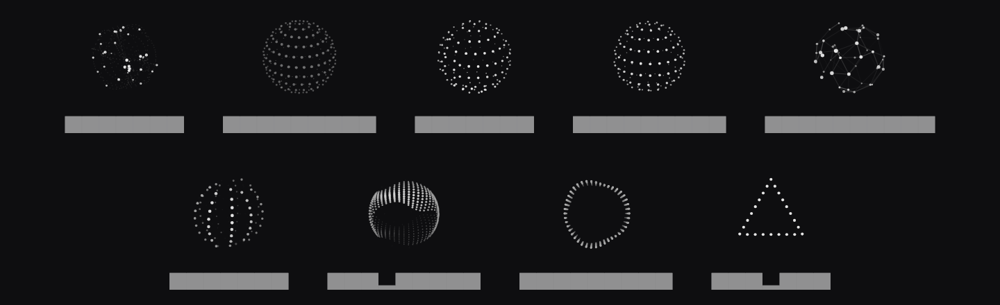

The orbs are a port of [`thinking-orbs`](https://github.com/Jakubantalik/thinking-orbs)
by Jakub Antalik (MIT). The glow effects are new, written to match the look of
the web "Voice", "Beam" and "Image generation" effects from Libraries.dev, but
built for Flutter rather than copied from them.

---

## Contents

1. [Install](#install)
2. [ThinkingOrb](#thinkingorb)
3. [ThinkingVoiceGlow](#thinkingvoiceglow)
4. [ThinkingBeam](#thinkingbeam)
5. [ThinkingImageReveal](#thinkingimagereveal)
6. [Image orb and voice orb](#image-orb-and-voice-orb)
7. [Colours and themes](#colours-and-themes)
8. [Accessibility](#accessibility)
9. [Performance](#performance)
10. [Running the example](#running-the-example)
11. [Credits](#credits)

## Install

```yaml
dependencies:
  thinking_orb: ^0.2.0
```

```dart
import 'package:thinking_orb/thinking_orb.dart';
```

Needs Flutter 3.35 or newer.

---

## ThinkingOrb

The basic orb. With no arguments you get the "working" animation at 64 px,
using whichever brightness your app theme has.

```dart
const ThinkingOrb()
```

Pick a different animation with `state`:

```dart
ThinkingOrb(state: ThinkingOrbState.searching)
```

| State | What you see |
|---|---|
| `working` | particles circling on tilted orbits |
| `searching` | a scan line sweeps across a dotted globe |
| `solving` | bands scramble in quarter turns, then click back |
| `listening` | a wave rolls through rings of dots |
| `connecting` | a constellation wires itself up, with packets running along the edges |
| `weaving` | three strands plait around the sphere |
| `composing` | an undulating sash of dots |
| `breathing` | a flat ring that slowly changes shape |
| `shaping` | a dotted outline morphing circle → triangle → square |

For `shaping` you can hold a single outline instead of the full morph:

```dart
ThinkingOrb(state: ThinkingOrbState.shaping, shape: ThinkingOrbShape.triangle)
```

### Sizes

The orb has two hand-tuned designs: **64** (the chat avatar size) and **20**
(sits inline with text). They are separate designs with their own dot counts
and speeds, not one design scaled up and down. Any size works; the package
uses whichever design is closer (the split is at about 36 px).

```dart
Row(children: const [ThinkingOrb.compact(), SizedBox(width: 8), Text('Thinking…')])
```

### Common options

```dart
ThinkingOrb(
  state: ThinkingOrbState.working,
  size: 64,
  theme: ThinkingOrbTheme.auto, // auto | light | dark
  speed: 1.0,                   // multiplies the built-in speed
  paused: false,
  semanticLabel: 'Working',
)
```

---

## ThinkingVoiceGlow

A glow along the bottom edge of any widget that moves with your audio level.
It's meant for voice input: a chat box that lights up while the user talks.

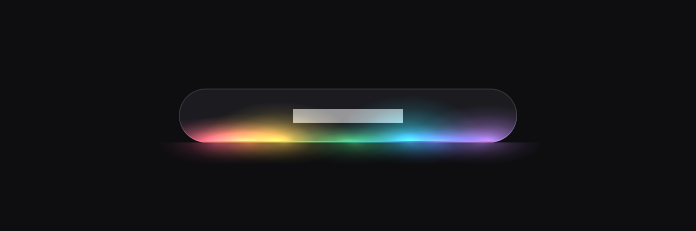

```dart
ThinkingVoiceGlow(
  level: micLevel,                 // 0.0 – 1.0, you provide it
  processing: waitingForReply,
  borderRadius: BorderRadius.circular(28),
  child: ChatInput(),
)
```

**Where does `level` come from?** From you. The package doesn't touch the
microphone, so it has no permissions to ask for and no audio dependency. Use
whatever you already record with and map the loudness to 0–1. Noisy values are
fine: the glow smooths them (quick to rise, slower to fall), so it looks like a
meter and not like jitter.

If you don't have a mic handy, a number you update yourself works just as well:
animate a `Tween`, or drive it from a text-to-speech callback.

### While the app is thinking

Set `processing: true` and the coloured lobes gather into one bright beam that
sweeps along the edge with a short trail. It's a good "I heard you, working on
it" cue between the user finishing and the answer starting.

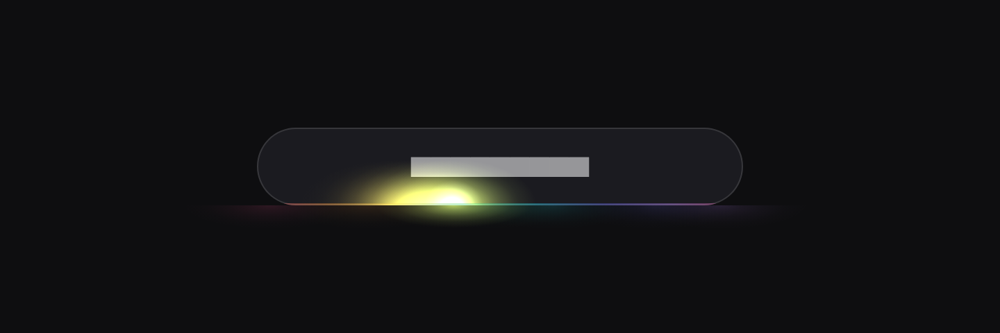

### Options

| Option | Default | What it does |
|---|---|---|
| `level` | `0` | live input level, 0–1 |
| `processing` | `false` | gather the glow into a travelling beam |
| `type` | `standard` | `standard` (chat box), `pill` (small recording pill), `mobile` (bottom of a phone screen). Changes how tall and wide the glow is |
| `colorVariant` | `colorful` | named colours, see below |
| `colors` | – | your own colours (2–7 looks best); overrides `colorVariant` |
| `borderRadius` | 28 | match your child's corners so the glow hugs the border |
| `strength` | `1` | overall opacity |
| `sensitivity` | `1` | gain on `level` before the noise gate |
| `threshold` | `0.04` | levels below this count as silence |
| `attack` / `release` | `0.06` / `0.35` | seconds to rise to / fall from a level |
| `reach` | `1` | how high the glow climbs |
| `spread` | `1` | how wide each lobe is |
| `flow` | `1` | how fast the lobes drift and pulse |
| `idle` | `0.12` | how much it breathes when silent (0 = fully off) |
| `speed`, `paused`, `theme`, `reducedMotion` | | the usual ones |

The input chain (sensitivity → threshold → attack/release) is there so you can
tune it to your microphone: if the glow flickers on background noise, raise
`threshold`; if it barely reacts to normal speech, raise `sensitivity`.

### Colour variants

`ThinkingGlowVariant` has eight sets: `colorful`, `mono`, `ocean`, `sunset`,
`forest`, `candy`, `ice` and `gold`. The same enum is used by `ThinkingBeam`.

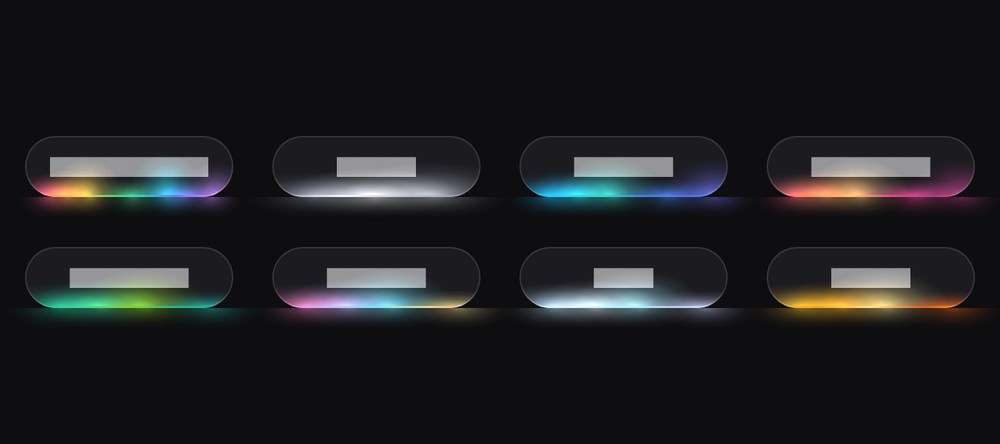

### On a light surface

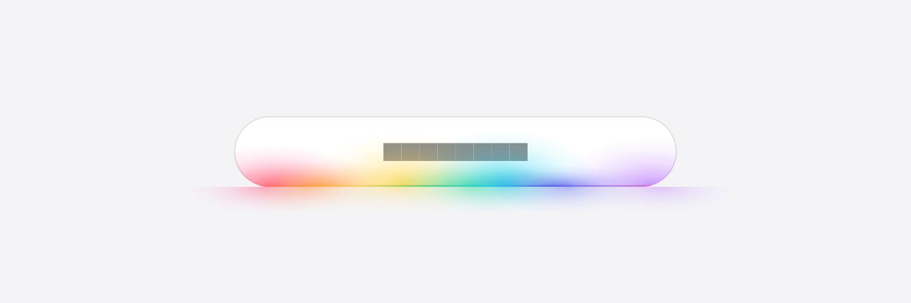

The glow switches blending when the surface is light so colours stay vivid
rather than washing out. `theme: ThinkingOrbTheme.auto` follows your app; set
`light` or `dark` if the widget sits on a surface that differs from the app.

---

## ThinkingBeam

A comet of colour that rides around the border of any widget.

```dart
ThinkingBeam(
  size: ThinkingBeamSize.md,
  colorVariant: ThinkingGlowVariant.colorful,
  strength: 0.85,
  borderRadius: BorderRadius.circular(20),
  child: MyCard(),
)
```

The beam follows the real outline of the child at an even speed, so it
doesn't rush along the short sides of a wide card the way a simple rotating
gradient does.

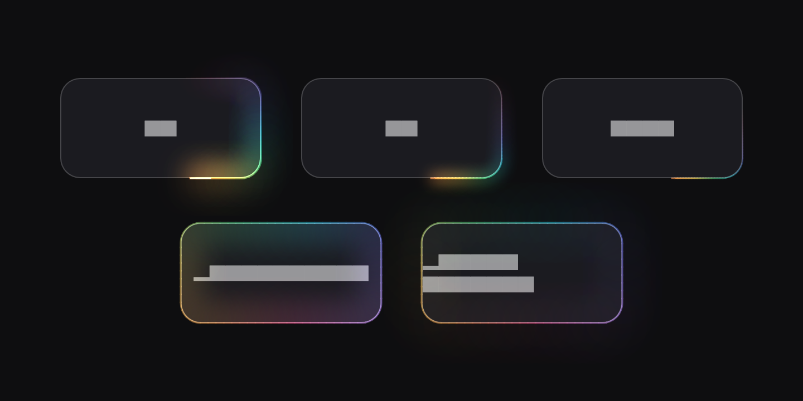

| `size` | Look |
|---|---|
| `md` | full beam: bright edge, outer bloom and an inner glow |
| `sm` | a smaller, tighter beam with a light bloom |
| `line` | just a thin line of light, for dense UIs |
| `pulseInner` | the whole border glows in colour and breathes, lighting the inside |
| `pulseOutside` | same, but spilling outward |

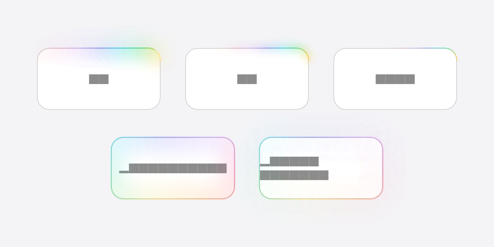

### Options

| Option | Default | What it does |
|---|---|---|
| `size` | `md` | see above |
| `colorVariant` / `colors` | `colorful` | named colours or your own list |
| `borderRadius` | 20 | match your child's corners |
| `strength` | `0.85` | glow intensity, 0–1 |
| `duration` | 3.2 s | time for one lap at `speed: 1` |
| `speed`, `paused`, `theme`, `reducedMotion` | | the usual ones |

> **Leave some room.** The outer bloom is painted past the child's bounds.
> If a parent clips its children (a `ClipRRect`, a `Card` with
> `clipBehavior`, a `ListView` with tight padding) the glow gets cut off. Give
> it a few pixels of space, about 24 for `md` and `pulseOutside`.

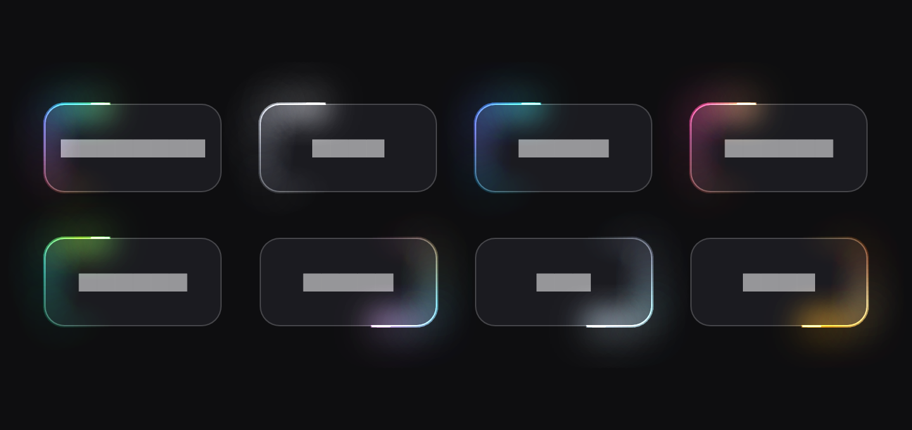

### Pairing it with an orb

A common one: a "searching" chip with the orb inside a beam.

```dart
ThinkingBeam(
  size: ThinkingBeamSize.md,
  borderRadius: BorderRadius.circular(28),
  child: Container(
    padding: const EdgeInsets.symmetric(horizontal: 18, vertical: 14),
    decoration: BoxDecoration(
      color: const Color(0xFF1A1A1E),
      borderRadius: BorderRadius.circular(28),
    ),
    child: Row(mainAxisSize: MainAxisSize.min, children: const [
      ThinkingOrb.compact(state: ThinkingOrbState.searching),
      SizedBox(width: 10),
      Text('Searching…'),
    ]),
  ),
)
```

---

## ThinkingImageReveal

A loader for generated pictures. It covers the frame with a churning mosaic (or
a colour wash), then clears it to show the real image underneath.

```dart
ThinkingImageReveal(
  images: [AssetImage('assets/a.png'), AssetImage('assets/b.png')],
  preset: ThinkingRevealPreset.pixelsOrganic,
  width: 320,
  height: 320,
  borderRadius: BorderRadius.circular(20),
)
```

Three looks, shown here at four moments of one reveal:

**`pixelsOrganic`**: soft squares that twinkle and shrink away at random.

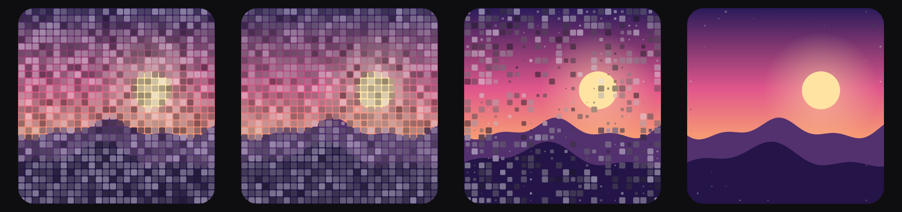

**`pixelsMechanic`**: hard blocks that tick over in steps and clear row by row,
with a thin scan line.

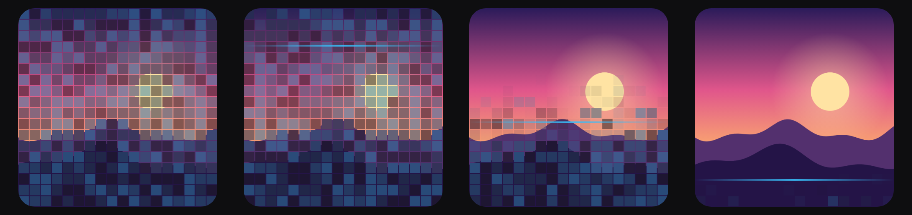

**`sweepGradient`**: a flowing colour wash wiped away by a soft diagonal edge.

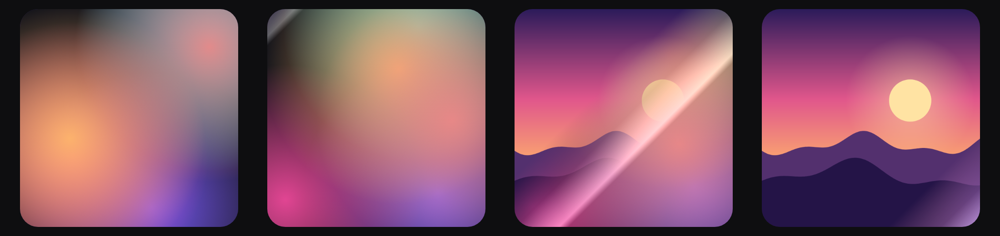

The mosaic is tinted with colours sampled from the picture it's about to show,
so it looks like an early, blocky version of the image, not generic noise.

### Two ways to use it

**Looping** (the default, `autoReveal: true`). The image sits for a moment, the
mosaic returns over it, the next image is swapped in behind the cover, and it
clears again. Good for a gallery or a demo.

**Driven by you** (`autoReveal: false`). The loader churns until you call
`replay()`, runs one reveal, and then holds the finished picture. This is what
you want for a real "generating…" state: show the loader while your request is
in flight, then tell it to reveal.

```dart
final reveal = ThinkingImageRevealController();

ThinkingImageReveal(
  controller: reveal,
  images: [NetworkImage(url)],
  autoReveal: false,
  onRevealed: () => debugPrint('picture is on screen'),
);

// when your request finishes:
reveal.replay();
```

The controller also has `next()` (move on to the next image in the list) and
`isRevealed`.

### Good to know

- **Images load before the reveal starts.** If a picture hasn't finished
  decoding when its turn comes, the loader just keeps churning until it has.
  A URL that never loads keeps the loader going indefinitely (nothing throws).
- **Size.** Pass `width` and `height`, or leave either out to fill the space
  you're given (300 if that space is unbounded).
- **Fit.** `fit` works like on a normal `Image` (default `BoxFit.cover`).
- **No shaders.** It's plain canvas drawing, so it works on every platform
  Flutter runs on, including web.

### Options

| Option | Default | What it does |
|---|---|---|
| `images` | required | pictures to resolve into, cycled when looping |
| `preset` | `pixelsOrganic` | the look of the loader |
| `autoReveal` | `true` | loop on its own, or wait for the controller |
| `controller` | – | `replay()`, `next()`, `isRevealed` |
| `width`, `height` | fill | size of the frame |
| `borderRadius` | 20 | corners of the frame |
| `fit` | `cover` | how the picture fills the frame |
| `onRevealed` | – | called each time a picture finishes revealing |
| `semanticLabel` | `Generated image` | screen reader label |
| `speed`, `paused`, `theme`, `reducedMotion` | | the usual ones |

---

## Image orb and voice orb

Two more members of the orb family.

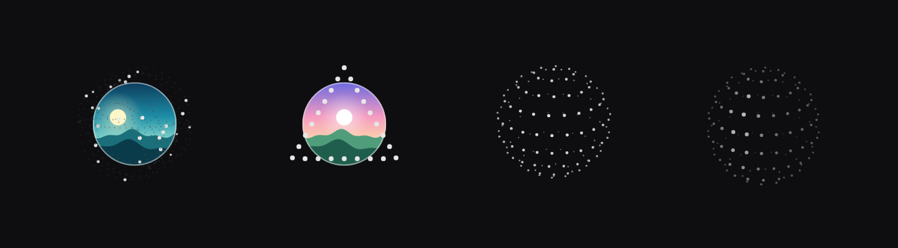

### `ThinkingImageOrb`

A round picture sitting *inside* an orb. The dots are split at the sphere's
midplane: the far half is drawn behind the picture and the near half in front,
so the marks seem to circle the image. Good for an avatar that shows activity.

```dart
ThinkingImageOrb(
  image: NetworkImage(url),
  size: 96,
  state: ThinkingOrbState.working,
  placeholder: const SizedBox.shrink(), // while the image loads
  showBorder: true,
)
```

The image is a normal Flutter `Image`, so the framework decodes and caches it;
nothing is decoded while animating.

### `ThinkingVoiceOrb`

A voice orb driven by a state and a level that you supply.

```dart
ThinkingVoiceOrb(
  state: VoiceOrbState.listening, // idle | listening | processing | speaking
  intensity: 0.8,                 // 0–1
)
```

Like the glow, there's no microphone dependency. Amplitude and tempo follow a
smoothed energy, so changes glide. `processing` sweeps a scan line across the
dots and `speaking` adds a syllable-like rhythm.

### `ThinkingBorderBeam`

The original single-colour border beam. It still works; `ThinkingBeam` is the
richer successor if you want colour and glow.

```dart
ThinkingBorderBeam(
  speed: 0.25,                       // laps per second
  strokeWidth: 2,
  borderRadius: 12,
  colors: [Colors.indigo, Colors.cyan], // optional
  child: YourWidget(),
)
```

---

## Colours and themes

Every widget has a `theme`: `auto` (follows `Theme.of(context).brightness` and
updates live), `light` (for light backgrounds) or `dark` (for dark ones).

- **Orbs** are monochrome by design: depth comes from dot size and ink weight.
  `ThinkingOrbColors` lets you tint the ramp if you want; the default matches
  the original.

  ```dart
  ThinkingOrb(colors: ThinkingOrbColors(
    darkestInk: Color(0xFF1E1B4B),
    lightestInk: Color(0xFFC7D2FE),
  ))
  ```
- **Glows** (`ThinkingVoiceGlow`, `ThinkingBeam`) use `ThinkingGlowVariant` or
  your own `colors` list. The `mono` variant flips between pale and charcoal so
  it never vanishes on the wrong background.

---

## Accessibility

- Orbs expose `Semantics(image: true)` with a sensible label per state
  ("Searching…", "Thinking…"). Override it with `semanticLabel`.
- When the platform asks for reduced motion (`MediaQuery.disableAnimations`),
  everything stops animating:
  - orbs show one static frame,
  - the glow and beam show a single still frame,
  - `ThinkingImageReveal` skips the loader and just shows the picture.

  Force it on or off per widget with `reducedMotion: true / false`.
- The glow widgets ignore pointer events, so they never get in the way of taps
  on the thing they decorate.

## Performance

- Each effect is one `CustomPainter` in its own `RepaintBoundary`. A per-widget
  `Ticker` only advances a time value and repaints; there's no `setState`
  per frame and nothing rebuilds.
- Tickers come from the widget's `TickerProvider`, so they pause automatically
  on routes that aren't visible, and `paused: true` stops them entirely.
- The orbs reuse pooled dot objects and buffers, so steady-state frames
  allocate almost nothing, and the shared orb clock keeps any number of orbs
  in step with one another.
- The glows use blurred strokes and radial gradients, which cost more than
  plain circles. In practice that's fine for a handful on screen; if you plan
  to put dozens in a long list, prefer `ThinkingBeamSize.line` or pause the
  ones that aren't in view.
- `ThinkingImageReveal` decodes your image once and keeps a tiny 32×32 colour
  grid for tinting; nothing is decoded per frame.

## Running the example

```bash
cd example
flutter run
```

The example has a tab for each widget, with a control for every option, an
"all variants" panel, and a light/dark switch. The pictures it uses are bundled
in `example/assets`, so it works offline.

To regenerate the screenshots in this README:

```bash
flutter test tool/render_docs_test.dart
```

## How the orbs were checked

`test/golden_vectors_test.dart` compares every dot and line of every state ×
size × several timestamps against frozen vectors from the original library
(tolerance 1e-4), and `test/dense_golden_test.dart` does the same for 720
frames generated by running the original TypeScript engine unmodified
(`tool/gen_dense_golden.mjs`). The glow widgets are covered by widget
tests in `test/glow_effects_test.dart`.

## Credits

`ThinkingOrb` is a derivative of
[`thinking-orbs`](https://github.com/Jakubantalik/thinking-orbs) by Jakub
Antalik (MIT), which descends from inkform's halftone-sphere engine. The tuned
presets and animation maths come from that project. `ThinkingImageOrb`,
`ThinkingVoiceOrb`, `ThinkingBorderBeam`, `ThinkingVoiceGlow`, `ThinkingBeam`
and `ThinkingImageReveal` are additions made for this package. See
[LICENSE](LICENSE).
